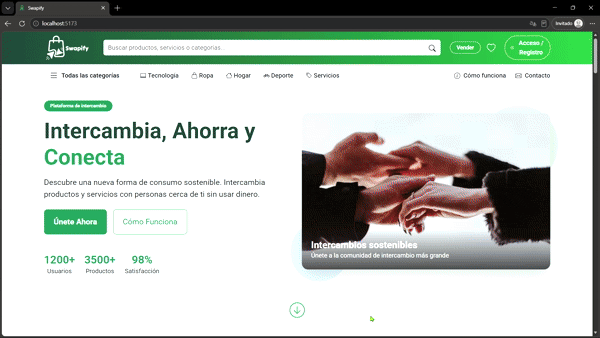

# Swapify - Plataforma de Trueque Digital

Swapify es una plataforma web diseñada para facilitar el intercambio de bienes y servicios sin necesidad de dinero. Utilizando un sistema de créditos y reputación, fomentamos la economía circular y el consumo responsable.

Este proyecto fue desarrollado como parte de un desafío técnico en el contexto formativo de los ciclos de Desarrollo de Aplicaciones Web (DAW) y Desarrollo de Aplicaciones Multiplataforma (DAM), implementando una arquitectura moderna y escalable.

> ⚠️ **Nota**
>  
> Este proyecto ha sido desarrollado con fines educativos y de demostración.
> No está pensado para su uso en entornos de producción sin aplicar medidas adicionales
> de seguridad, escalabilidad y mantenimiento (hardening).



## 🚀 Tecnologías Principales

El proyecto está dividido en dos partes principales:

*   **Frontend**: [React](https://react.dev/) + [TypeScript](https://www.typescriptlang.org/) + [Vite](https://vitejs.dev/) + [Bootstrap](https://react-bootstrap.github.io/).
*   **Backend**: [Kotlin](https://kotlinlang.org/) + [Spring Boot](https://spring.io/projects/spring-boot) + [PostgreSQL](https://www.postgresql.org/).
*   **Infraestructura**: Docker & Docker Compose para orquestación de contenedores.

## 📂 Estructura del Proyecto

*   `/swapify-frontend`: Código fuente de la aplicación web (SPA).
*   `/SwapifyAPI`: Código fuente de la API RESTful.
*   `/initdb`: Scripts de inicialización y restauración de base de datos.
*   `docker-compose.yml`: Configuración para levantar todo el entorno con un solo comando.

## 🛠️ Guía de Inicio Rápido (Recomendado)

La forma más sencilla de ejecutar Swapify es utilizando **Docker Compose**. Asegúrate de tener Docker instalado y ejecutándose.

1.  **Clonar el repositorio**:
    ```bash
    git clone <url-del-repositorio>
    cd AlicanteFutura2002
    ```

2.  **Configurar variables de entorno**:
    El proyecto incluye un archivo de plantilla `.env.example` con la configuración predeterminada para desarrollo local.
    
    Crea una copia de este archivo y renómbralo a `.env`:
    
    ```bash
    cp .env.example .env
    ```
    
    > **Nota**: Si vas a desplegar en producción, asegúrate de cambiar las contraseñas y credenciales dentro del archivo `.env` generado. Nunca subas el archivo `.env` real al repositorio.

3.  **Ejecutar la aplicación**:
    ```bash
    docker-compose up --build
    ```

    Esto levantará:
    *   **Base de Datos**: Puerto `5432`.
    *   **Backend (API)**: Puerto `8080` (http://localhost:8080).
    *   **Frontend**: Puerto `5173` (http://localhost:5173).

## Gestión de Base de Datos

### Modo Docker (Automático - Recomendado)
Al usar `docker-compose up`, se crea automáticamente un contenedor con PostgreSQL 17.
*   Los datos se persisten en un volumen de Docker llamado `pgdata`.
*   Si existe un archivo de respaldo en `./initdb/swapify_backup.dump`, el sistema intentará restaurarlo automáticamente al iniciar por primera vez.

### Modo Manual (Sin Docker)
Si prefieres instalar PostgreSQL en tu máquina:
1.  Instala PostgreSQL 17.
2.  Crea una base de datos llamada `swapify_db_local` (o el nombre que prefieras).
3.  Actualiza el archivo `.env` (o `application.properties` en el backend) con tus credenciales locales.
4.  Ejecuta el backend normalmente.

## 📖 Documentación Detallada

Si prefieres ejecutar cada parte por separado o necesitas más detalles técnicos sobre el desarrollo, consulta los README específicos:

*   📘 **[Documentación del Frontend](./swapify-frontend/README.md)**: Instrucciones para desarrollo en React, scripts disponibles y estructura de componentes.
*   📗 **[Documentación del Backend](./SwapifyAPI/README.md)**: Guía para configurar Spring Boot, endpoints y conexión a base de datos.

## ✨ Funcionalidades Clave

*   **Sistema de Trueque**: Intercambio de productos mediante créditos.
*   **Chat en Tiempo Real** (implementación básica): Comunicación directa entre usuarios.
*   **Geolocalización** (visualización aproximada): Visualización de productos en mapa.
*   **Gestión de Usuarios**: Perfiles, reputación y seguridad.

## 👥 Equipo de Desarrollo

Este proyecto fue creado por un equipo de 4 desarrolladores como parte del desafío Alicante Futura en 2025:

*   **David A. Sánchez**
*   **Jose Miguel P. P.**
*   **Nicolás L. D.**
*   **Daniel C. G.**

## 📄 Licencia

Este proyecto está bajo la Licencia MIT - mira el archivo [LICENSE](LICENSE) para más detalles.
